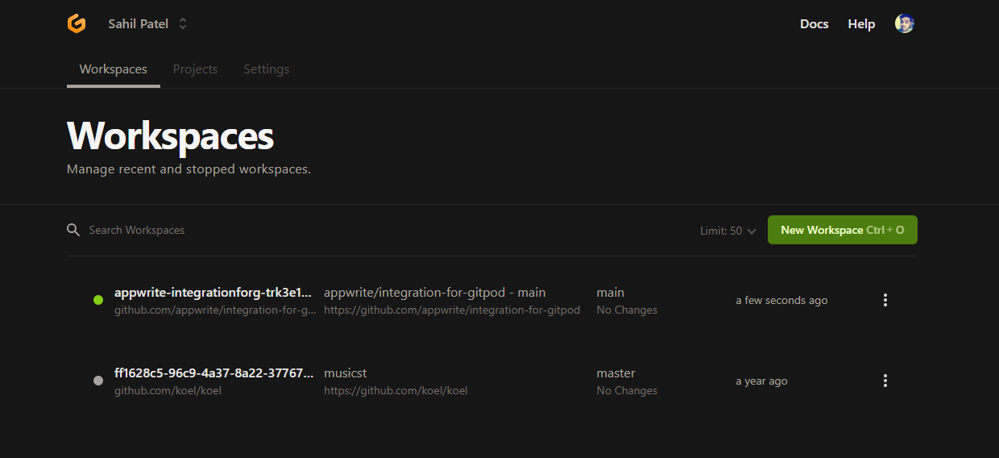
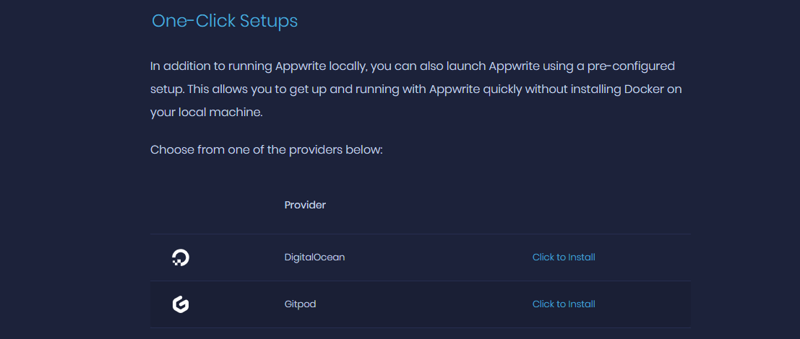
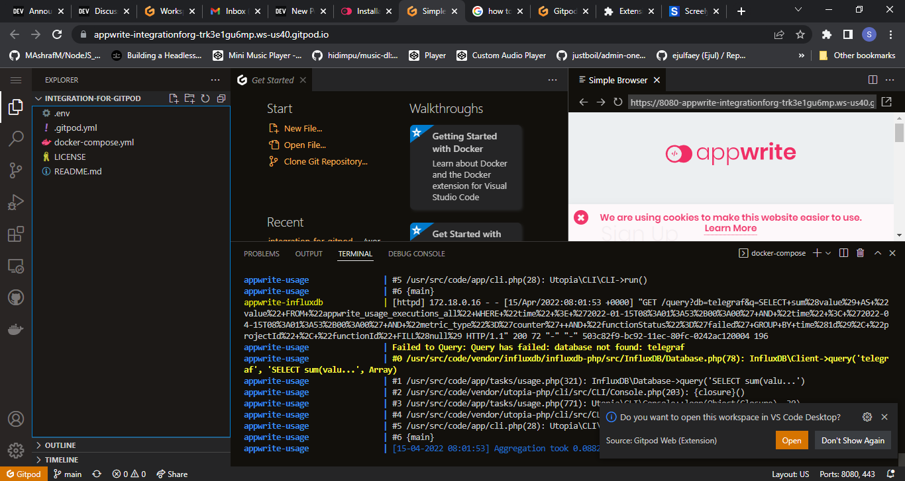
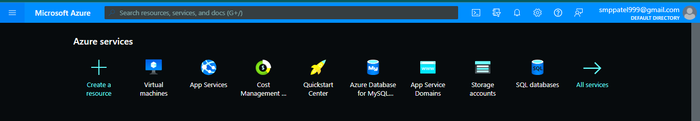
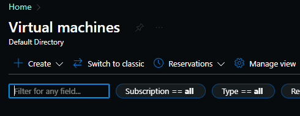
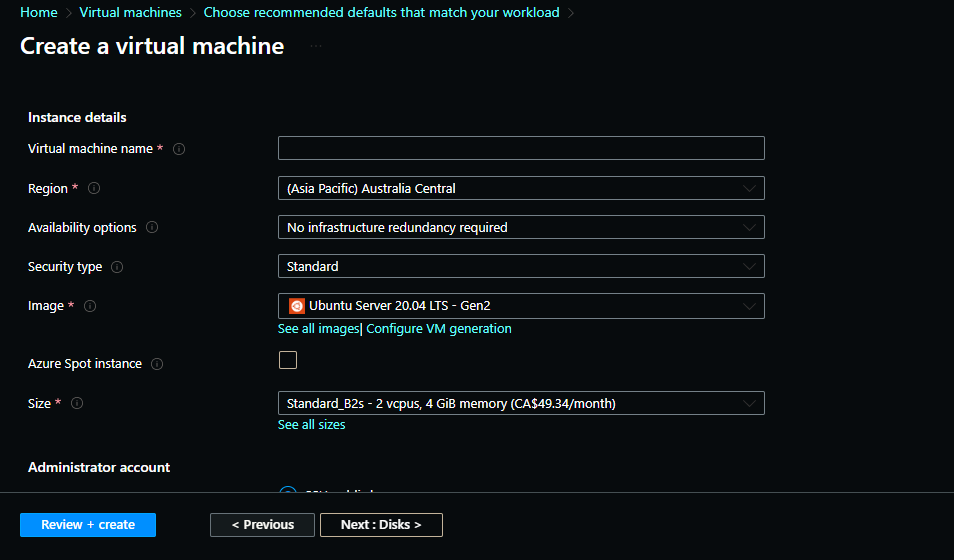
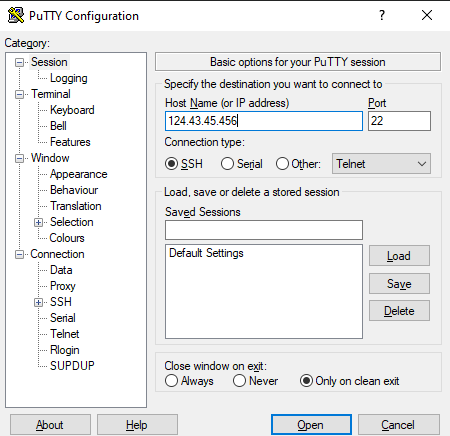
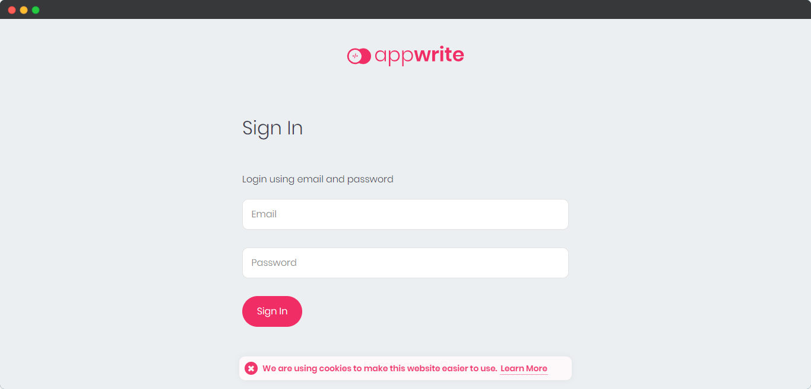

I have started building my using Appwrite as a backend service for the Hackathon on Dev.to. Most of the time I work with cloud platforms which are accessible on the internet for development and testing, like firebase and supabase or my own cloud server. Appwrite has its own cloud platform upcoming. There are other options like Gitpod and DigitalOcean to deploy your app. I have deployed appwrite on Gitpod which is just one click long process and on Azure Virtual Machine.

I looked up on Google how to install Appwrite on Azure but no article came up or something that is helping. So I tried on my own using the Azure App Service but no luck after changing many configs. 

Appwrite has option to deploy an instance on Gipod. I have used it and trust me it is an awesome service providing the installation of the appwrite. Below are the 2 ways to deploy appwrite on the internet.

## Deploy Appwrite For Free on Gitpod
Gitpod's free plan should be just fine for you to fire up and running your appwrite deployment. There are some limitations to free plan. You can only have 50 hours of running it every month. I think this is a very generous plan for development and testing.

## 1. Create an account on Gitpod
Here is the link to signup for gitpod. [Gitpod Home Page](https://gitpod.io/) [Gitpod Pricing](https://www.gitpod.io/pricing)


Sign up and you will be redirected to the workspace.




## Step 2: Deploy Appwrite
Once account is up and running, make sure you are logged in and go to the installation docs. [Appwrite Installation Docs](https://appwrite.io/docs/installation)

Scroll down and find "one click setups" section.



Click on "Click to install" link for Gitpod. Now behind the scenes Gitpod will fetch the docker yaml configuration from the Github repo and and pull the image from docker as well set it up.



You may see a screen like this once the deploy is finished. On the right hand, in the simple browser window, open the URL link into another tab, create account and you are good to go.


# Deploy Appwrite with Azure
Azure will cost you money to host appwrite on Cloud VM. Feel free to use Gitpod instead.

### Get Your Virtual Machine Ready
1. Go to Azure Portal. Link - [Azure portal](https://portal.azure.com/)
2. Create an account if you do not have one.
3. You will be landed on the home page of the portal like below.



4. Choose <code>Virtual Machines</code> and go ahead.
5. This screen will show all the deployed instances.

 

6. Click <code>Create</code> to create a new VM.

![[choose-vm.png]]
7. Choose the second option, <code>Azure Virtual Machine with preset configuration</code> to create a new VM using preset.
8. You will be asked to choose different environment based on the need but just skip it. You will find a <code>Skip for now</code> button down somewhere.
9. Now, lets create the VM for out needs.

Choose the subscription and the resource group first, create if you do not have it.



Fill up the details based on your needs. Below is my configuration.

* Choose the Virtual Machine Name - appwrite
* Choose the region - Canada (Canada Central) - It should be the nearest
* Availability Options - No infrastructure redundancy required
* Security - Standard
* Image: Ubuntu Server 20.04 LTS - Gen2
* Azure Spot - Unchecked
* Size - Standard_B2s, 2vcps 4 GiB Memeory - I heard someone saying it automatically kills the setup of appwrite if the minimum RAM size is less than 2 GB. So that is the reason for choosing the <code>Standard B2</code>.
* Administration type - You can go ahead and use SSH as the login type but I prefer it with username and password.
* Now click <code>Review  + Create </code>.
* Azure will validate everything and then show you all the information filled. 
* Review it and click on create. It will start the process of deployment of your VM on Azure cloud. 
* Once the VM is ready, go to the VM's resource and copy the public IP address. Make sure to make it static and not dynamic. 

10. Connect to your instance. 
	* Download and Install Putty
	* Add the IP address copied and click <code>Open</code>.
	* Putty will prompt for credentials. Enter credentials and click enter.
	* If everything would be okay so far then you will be logged into the instance with sudo permissions.
	




11. Time to add docker to the VM.
12.  Run commands below to install docker on your VM step by step.

Check out this [link](https://www.digitalocean.com/community/tutorials/how-to-install-and-use-docker-on-ubuntu-20-04) for in detail information about these commands.

```bash
#Update the list of packages
sudo apt update

#Instll prerequisite packages
sudo apt install apt-transport-https ca-certificates curl software-properties-common

#Add GPG key for the official docker repo
curl -fsSL https://download.docker.com/linux/ubuntu/gpg | sudo apt-key add -

#Add the docker repo of apt sources
sudo add-apt-repository "deb [arch=amd64] https://download.docker.com/linux/ubuntu focal stable"

#Install docker
sudo apt install docker-ce

#Check status of docker daemon
sudo systemctl status docker	
```

13. Run the command to install appwrite.

	```bash
	docker run -it --rm \
    --volume /var/run/docker.sock:/var/run/docker.sock \
    --volume "$(pwd)"/appwrite:/usr/src/code/appwrite:rw \
    --entrypoint="install" \
    appwrite/appwrite:0.13.4
```

Note: If you find the error below, do these steps.
```bash
docker: Got permission denied while trying to connect to the Docker daemon socket at unix:///var/run/docker.sock: Post "http://%2Fvar%2Frun%2Fdocker.sock/v1.24/containers/create": dial unix /var/run/docker.sock: connect: permission denied.
See 'docker run --help'.
```

Run these command and then run the installation command again. For more details on these commands, check out [this](https://stackoverflow.com/questions/48957195/how-to-fix-docker-got-permission-denied-issue) stack overflow question.

```bash
$ sudo groupadd docker
sudo usermod -aG docker $USER
newgrp docker
docker run hello-world # if docker runs the hello-world image then you are good to go.
```

Run the installation command again and there should be no problems.

Once Docker has successfully pulled the  image from the hub it will ask some of the questions, which are as below :

1. Choose your server HTTP port: (default: 80)
Ans: Keep it default.

2. Choose your server HTTPS port: (default: 443)
Ans: Keep it default.

3. Choose a secret API key, make sure to make a backup of your key in a secure location (default: 'your-secret-key')
Ans: Keep it default.

4. Enter your Appwrite hostname (default: 'localhost')
Ans: Enter the public IP address of your VM instance

5. Enter a DNS A record hostname to serve as a CNAME for your custom domains.
You can use the same value as used for the Appwrite hostname. (default: 'localhost')
Ans:  Again, Enter the public IP address of your VM instance

Once you click ok, it will run <code>docker-compose</code> and set up the config for appwrite,


Once done, You will see a message that "Appwrite Installed Successfully."
Now, to access the Appwrite console go to the public IP address of your VM and you should see the screen like below. Create an account and start building using Appwrite.




