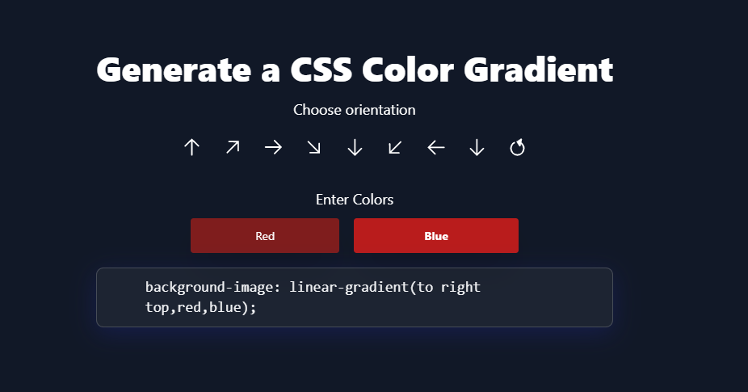

A gradient generator seems fun. I do mostly use mycolors.space website to generate gradient in different formats. In the weekend I decided to make my own gradient generator and I have made a similar clone of mycolors.space. Take a look at the demo here.

You can find the source code of the project here and the live demo here.

[](https://gradient-generator-react.netlify.app/)

<a href='https://github.com/sahilpatel09/Gradient-Generator-using-React.js' target="_blank"></a>


[button url="http://www.google.com"]

The Gradient generator has options for changing the direction and the colors.  It takes to parameters of colors and generates 3 most related colors between them. 

## Get The Environment Ready
First of all, create a react app using create-react-app and add support for tailwindcss.

```bash
npx create-react-app color-generator-react
cd color-generator-react
```

Now, cd into the project, add the only dependancy which is Chroma-js.

```bash

yarn add chroma-js
OR
npm install chroma-js
```

### Add TailwindCSS

```bash
yarn add -D tailwindcss postcss autoprefixer
OR
npm install -D tailwindcss postcss autoprefixer
```

The code below creates a <code>tailwindcss.config.js</code> file. As we have passed the <code>-p</code> flag, it also creates a <code>postcss.config.js</code> file with default config to use with tailwindcss.

```bash
npx tailwindcss init -p
```

Now, let us create a <code>tailwind.css</code> file in the assets folder.
```bash
mkdir assets
cd assets
touch tailwind.css // Linux
OR 
echo. > tailwind.css // Windows
```

In the created <code>tailwind.css</code> file, add the below tailwindcss directives.
```CSS
@tailwind base;
@tailwind components;
@tailwind utilities;
```

Congrats, Tailwindcss is sucessfully added to the project.

Once the tailwindcss is added we can go ahead and start working on the project. But before that, let us have a little introduction of chroma-js.

## Introduction to Chroma-js
Chroma-js is just an amazing piece of software when it comes to color manipulation, conversion and scaling. It has everything you need for every sort of manipulation from darkening or brightening to hue manipulation. It also gives you results in different color spaces. It can read, convert, analyze and manipulate colors from and to different formats.

We are going to use Chroma-js to generate 3 more colors from the actual given 2 parameters and create a gradient of 5 colors. Why are we doing it? Because if we use 2 colors only there is a sudden change of color in the /


## Let us Build the Layout

There is only single main component for the sake of simplicity. The markup below makes anything between the <code>div</code> to be centered using the flexbox properties.
```html
    <div className="flex items-center bg-gray-900 justify-center md:fixed h-screen inset-0 px-10">
    /* All the content is centered. */
    </div>
```

To create the controls to change the direction of the color spread, add the below code in to the <code>App.js</code> file.

```JSX

          <div className="flex items-center justify-center p-2 gap-2 flex-wrap md:gap-5">

              <button title="to top" onClick={() => changeOrientation("to top") }>
              
              </button>

              <button title="to right top" onClick={() => changeOrientation("to right top") }>
              
              </button>

              <button title="to right" onClick={() => changeOrientation("to right") }>
              
              </button>

              <button title="to right bottom" onClick={() => changeOrientation("to right bottom") }>
              
              </button>

              <button title="to bottom" onClick={() => changeOrientation("to bottom") }>
              
              </button>

              <button title="to bottom left" onClick={() => changeOrientation("to bottom left") }>
              
              </button>

              <button title="to left" onClick={() => changeOrientation("to left") }>
              
              </button>

              <button title="to left top" onClick={() => changeOrientation("to left top") }>
              
              </button>

              <button onClick={() => changeOrientation("circle") }>
              
              </button>

          </div>

```

To make some of them rotate, add this css in <code>App.css</code> file.

```CSS
.rotate-135 {
    transform: rotate(135deg);
}

.rotate-225 {
    transform: rotate(225deg);
}
button:focus{
    border: 2px solid white;
    border-radius:50%;
    outline: none;
    transition: all 220ms ease-in;
}

```

It should now look like this.

![[direction-controls.png]]

Let us now add 2 buttons to take the color inputs from the user and a little CSS code box below.

```jsx
<h2 className="text-xl text-white text-center py-3 mt-5 italic font-cursive">Enter Colors & press Enter.</h2>
<div className="text-white text-center py-2 rounded mb-3  text-white w-40 mx-auto">
  <h2 className="bg-amber-700">{error}</h2>
</div>


<div className="flex items-center justify-center flex-wrap">
    <form className="flex gap-5 justify-center items-center flex-wrap">

        <input type="text"
             ref={hex}
             defaultValue={color1}
             style={icolor1}
             className="rounded px-2 py-3 text-center shadow-2xl font-bold bg-red-900" 
             name="hex" />

        <input type="text"
             ref={hex2}
             defaultValue={color2}
             style={icolor2}
             className="rounded px-2 py-3 text-center shadow-2xl font-bold bg-red-700" 
             name="hex2"/>

        <input
              type="submit"
              className="hidden"
              onClick={(e) => doJob(e)}
              />

      </form>
</div>

  <div className="box md:w-[640px] w-[350px] h-auto mx-auto break-all mt-4 p-2 ">
      <p className="p-3 text-gray-200 font-mono text-base md:text-xl text-center font-semibold">
          <span className="text-gray-100">background-image: </span> { cssCode }
      </p>
  </div>

```

<br>

```CSS
.font-cursive {
    font-family: cursive;
}

.box{
    background: rgba( 255, 254, 254, 0.05 );
    box-shadow: 0 8px 32px 0 rgba( 31, 38, 135, 0.37 );
    backdrop-filter: blur( 9.5px );
    -webkit-backdrop-filter: blur( 9.5px );
    border-radius: 10px;
    border: 1px solid rgba( 255, 255, 255, 0.18 );
}
```

It should look like this once add the markup and css. Now at this moment, we have finished building the basic layout for the app.



## Add the Functionality

First of all we have to declare all the variables and refs for the colors and buttons. To use the state in the React Functional components, I will be using useState hook. 


```javascript

    const [color1, setColor1] = useState("#FF6347"); //input box one default color
    const [color2, setColor2] = useState("#0000FF"); //input box2 one default color
    
    //dynamically generated colors using chroma js
    const [generated1, setGenerated1] = useState("");
    const [generated2, setGenerated2] = useState("");
    const [generated3, setGenerated3] = useState("");
  
  //css controls
    const [direction, setDirection] = useState("linear-gradient");
    const [orientation, setOrientation] = useState("to right bottom");
    
    //errors var
    const [error, setError] = useState("")

  //color vars for dynamic color for the input text
    const [invertedcolor1, setinvertedColor1 ] = useState("")
    const [invertedcolor2, setinvertedColor2 ] = useState("")
    
    //refs to both the inputs
    const hex = useRef(color1);
    const hex2 = useRef(color2);

  //String style built for the div background to display the gradient color
  const ulStyle = { backgroundImage: direction + "("+orientation+","+color1 +","+generated1 +","+generated2 +","+generated3 +","+color2+")"}

  //string generated to copy by the user
    const cssCode = direction+ "("+orientation+","+color1 +","+generated1 +","+generated2 +","+generated3 +","+color2+");";


```

Now, when the arrow buttons are selected, the function changeOrientation is fired with direction string passed in like below.

```JSX
<button title="to right" onClick={() => changeOrientation("to right") }>
              
</button>

```

To handle the function we will write below function.

```Javascript

    const changeOrientation = function (ori){

    //condition to check if the passed in string is circle
    //if circle the radial gradient is generated
    //else linear gradient
    
        if(ori === "circle"){
          //setting the direction variable & orientation
            setDirection("radial-gradient")
            setOrientation(ori)
        }else{
            setDirection("linear-gradient")
            setOrientation(ori)
        }

    }

```

Now, when the background color is anything we have to set the input box color to dark or bright based on the background color dynamically. As well we will have to generate 3 dynamic colors from the input of the user. To handle that we have below functions.

```Javascript

  //the background color and text color style for inputs
  const icolor1 = { background: color1, color:invertedcolor1 }
    const icolor2 = { background: color2, color:invertedcolor2 }
    
    function checkContrast(color){
    
                //checking the luminance of the color
                const contrast = chroma(color).luminance();

        //returning the color based on the luminance of the background
                if(contrast > 0.6){
                    return "#000"
                }else{
                    return "#fff"
                }
    }
```

Dynamic color generator function. 

```Javascript

const generateColors = function () {
    //check if both the colors are valid colors
        if(chroma.valid(color1) && chroma.valid(color2)){

      //use the chroma-js scale feature to interpolate
      //between two color values and generate 3 more
      //dynamic colors including both input colors
      
            let word = chroma.scale([color1,color2])
                .mode('lch').colors(5);

      //set the generated colors.
      //Due to just 3 colors, I did not use loop.
            setGenerated1(word[1]);
            setGenerated2(word[2]);
            setGenerated3(word[3]);

      //At this moment, setting the text color of the input boxes
            setinvertedColor1(checkContrast(color1))
            setinvertedColor2(checkContrast(color2))

      //Setting the error to empty string
            setError("")

        }else{
          //if not set the error
            setError("Color are no valid.")
        }

    }

```


Now, whenever someone enters colors and press Enter button, then one function fire which is called <code>doJob(e)</code> where event is passed in the parameter.

```Javascript
    function doJob(e){
        //prevents default submission of the form
        e.preventDefault();
        //setting new values of the input colors
        //everything else changes on their own as the
        //values are reactive
        setColor1(hex.current.value);
        setColor2(hex2.current.value);

    }
  //use the hook instead of componentDidMount 
    useEffect(() => {
      //generating colors on the mount
        generateColors();
    });

```

Run the app using <code>yarn start or npm run start</code> and you should see the output of the app at localhost:3000.


