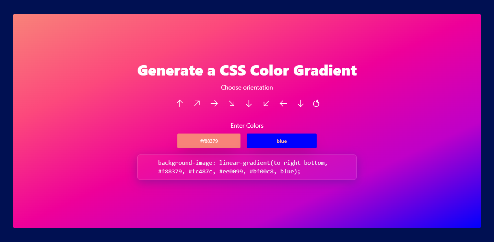

# Gradient Generator - React.js

A gradient generator seems fun. I do mostly use mycolors.space website to generate gradient in different formats. In the weekend I decided to make my own gradient generator and I have made a similar clone of mycolors.space. Take a look at the demo here.

The Gradient generator has options for changing the direction and the colors.  It takes to parameters of colors and generates 3 most related colors between them.

